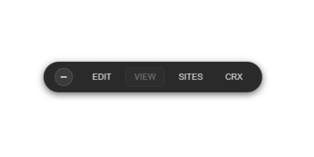
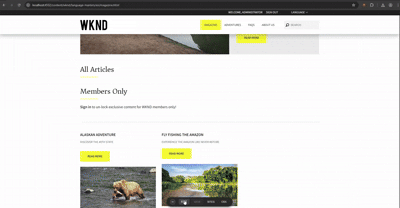

## **AEM Dev Toolbar for Chrome**



A lightweight **Chrome extension for Adobe Experience Manager (AEM)** developers.
It adds a floating toolbar to AEM pages (local or Cloud) so you can instantly switch between **Editor**, **Content**, **Sites**, and **CRXDE** views.


### 🚀 Features

- **Auto-detects** the current AEM page and context.
- **Works inside the AEM editor iframe** (unlike most dev helpers).
- **Quick navigation** between Author, Content, Sites, and CRXDE.
- **Lightweight and fast** — no dependencies, no frameworks.
- **Minimal dark/light theme** that adapts to AEM UI.




### 🧱 Project Structure

```
toolbar-aem/
├── src/                # Extension source files (manifest, scripts, styles)
├── scripts/            # Build scripts (packaging and minification)
├── dist/               # Generated output (after build)
│   ├── tmp/            # Temporary minified files
│   └── aem-dev-toolbar.zip
├── package.json
├── readme.md
└── ...
```


### ⚙️ Build & Package

This project uses a Node-based build pipeline to minify and package the extension.

#### 1. Install dependencies

```bash
npm install
```

#### 2. Build the extension

```bash
npm run build
```

This command will:

- Clean the `dist/` directory
- Minify all JavaScript and CSS files from `src/`
- Create a distributable archive:

  ```
  dist/aem-dev-toolbar.zip
  ```


### 🧩 Tech Stack

| Tool                         | Purpose                             |
| - | -- |
| **Terser**                   | JavaScript minification             |
| **Clean-CSS**                | CSS minification                    |
| **Archiver**                 | Builds the ZIP package              |
| **Rimraf** (Windows support) | Cross-platform cleaning for `dist/` |


### 💡 How to Load the Extension in Chrome

1. Run the build to generate the ZIP or use the `src/` folder directly.
2. Open Chrome and go to `chrome://extensions/`.
3. Enable **Developer Mode** (top-right).
4. Click **Load unpacked** and select the `src/` folder.
5. The toolbar will appear automatically on AEM pages.


### 🧠 Notes

- Fully compatible with **AEM 6.5+** and **AEM as a Cloud Service**.
- Tested with **Chrome 120+** and **Manifest V3**.
- Does not track or store user data.


### 🛠 Development

You can modify files inside `/src` and re-run:

```bash
npm run build
```

To see changes immediately in Chrome, click **Reload** under your extension in `chrome://extensions`.


### 🧾 License

This project is licensed under the **MIT License**.
See the [LICENSE](LICENSE) file for details.


### 👤 Author

**Nando Muñoz**
[GitHub Repository](https://github.com/nandovejer/toolbar-aem)
